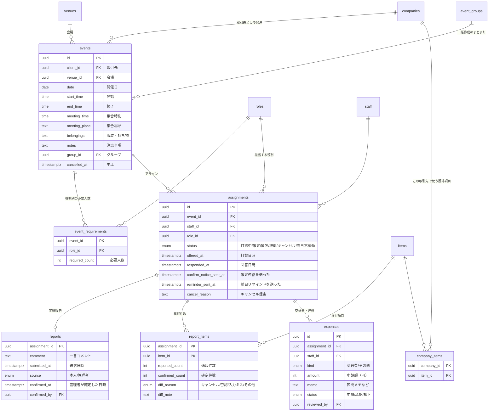
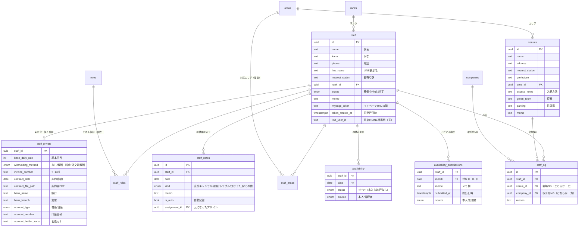
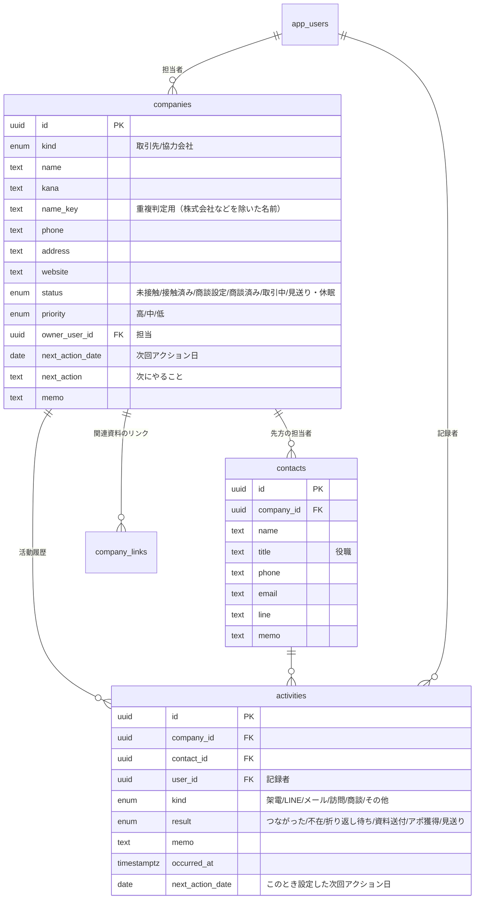

# DB スキーマ設計（Phase 0 案）

要件 §8 のデータモデル案を精査し、Phase 0 の回答（[../phase0-questions.md](../phase0-questions.md)）を反映したもの。**承認後、Phase 1 の最初にマイグレーションとして作成する。**
`★` はオーナーのみ読み書きできるテーブル（管理者からは RLS で読めない）。権限の詳細は [security.md](security.md)。

## 1. 設計の方針（かんたんに）

| 方針 | 内容 |
|---|---|
| お金は別テーブル | 単価・日当・支払額・口座などは ★ テーブルにだけ置く。管理者が読めるテーブルに金額の列は1つも置かない（交通費・経費の申請額だけは例外。要件 §3 で管理者に見せる） |
| 消さない | 基本は「無効化」「アーカイブ」。マスタ（役割・獲得項目など）は無効化で、過去データを壊さない |
| 日付は日本時間 | 開催日などは `date`（日本時間の暦日）、時刻は `time`、記録日時は `timestamptz` |
| 状態は計算で出す | 現場の「人員確定」「実施済」「実績確定」「締め済」は、保存せずに必要人数・日付・実績・締めの状態から毎回計算する（自動切替の取りこぼしがない）。保存するのは「中止」だけ |
| 履歴を残す | 金額・実績・アサインの状態・営業ステータスの変更は、トリガーで `audit_logs` に自動記録 |
| 締めたら固定 | 締めた月の実績・単価・経費・調整額は、DB のトリガーで変更を拒否する（オーナーがロック解除した場合だけ変更可） |

## 2. ER 図

見やすさのため4つに分けている（同じ名前のテーブルは同じもの）。

### 2-1. 現場・アサイン・実績

### 2-2. スタッフ・会場・マスタ

マスタ（`roles` 役割 / `items` 獲得項目 / `ranks` ランク / `areas` エリア）はすべて `id, name, sort_order, is_active`（ランクは定義メモ `description` も）。

| マスタ | 初期値（Phase 0 で決定。設定画面で追加・名前変更・並び替え・無効化できる） |
|---|---|
| 役割 | クローザー / キャッチャー / ディレクター |
| 獲得項目 | 新規 / MNP / 機種変更 / ドコモ光 / home 5G / dカード・でんき等の付帯 |
| ランク | SS / S / A＋ / A / B / C / D / E（上ほど高い。候補一覧の並び順にも使う） |
| エリア | 空（取り込み・登録時に作る） |

獲得項目は取引先ごとに使うものを選べる（`company_items`）。選んでいない取引先の現場では、有効な項目をすべて出す。

### 2-3. 営業（取引先・協力会社）

### 2-4. お金（★ すべてオーナーのみ）

```mermaid
erDiagram
  companies ||--o| company_billing : "★請求設定"
  companies ||--o{ client_rates : "★標準単価"
  venues ||--o{ client_rates : "★取引先×会場の標準"
  ranks ||--o| rank_rates : "★ランクごとの基準日当"
  events ||--o{ event_rates : "★現場ごとの上書き"
  items ||--o| incentive_rates : "★インセンティブ標準単価"
  events ||--o{ event_incentive_rates : "★現場ごとの上書き"
  assignments ||--o| assignment_private : "★日当の上書き"
  staff ||--o{ payment_adjustments : "★調整額"
  monthly_closings ||--o{ closing_logs : "★締め・ロック解除の履歴"
  staff ||--o{ payments : "★支払い（締め時のスナップショット）"
  companies ||--o{ invoices : "★請求（締め時のスナップショット）"

  company_billing {
    uuid company_id PK
    int closing_day "締め日（0=末日）"
    text invoice_note "請求書送付先メモ"
    bool bill_transport "交通費を請求に含める"
  }
  rank_rates {
    uuid rank_id PK
    int base_daily_rate "基準日当（登録・取り込み時の初期値）"
  }
  client_rates {
    uuid id PK
    uuid company_id FK
    uuid venue_id FK "空なら取引先全体の標準"
    enum kind "人日/現場固定/成果"
    uuid role_id FK "人日のとき"
    uuid item_id FK "成果のとき"
    int amount
  }
  event_rates {
    uuid id PK
    uuid event_id FK
    enum kind
    uuid role_id FK
    uuid item_id FK
    int amount
  }
  incentive_rates {
    uuid item_id PK
    int amount
  }
  event_incentive_rates {
    uuid event_id PK
    uuid item_id PK
    int amount
  }
  assignment_private {
    uuid assignment_id PK
    int daily_rate_override "日当の上書き"
  }
  payment_adjustments {
    uuid id PK
    uuid staff_id FK
    date month "対象月"
    int amount "＋/−"
    text reason "必須"
  }
  monthly_closings {
    date month PK
    enum status "締め済/ロック解除中"
    timestamptz closed_at
    uuid closed_by FK
  }
  closing_logs {
    uuid id PK
    date month FK
    enum action "締め/ロック解除/再締め"
    text reason
    uuid user_id FK
  }
  payments {
    uuid id PK
    uuid staff_id FK
    date month
    int daily_total "日当計"
    int incentive_total "インセンティブ計"
    int adjustment_total "調整計"
    int expense_total "交通費・経費計"
    int withholding_base "源泉対象額"
    int withholding_amount "源泉額"
    int net_amount "差引支払額"
    enum status "未確定/確定/支払済"
    date paid_on "支払日"
    jsonb detail "現場ごとの明細"
  }
  invoices {
    uuid id PK
    uuid company_id FK
    date month
    int subtotal "税抜"
    int tax "消費税"
    int total "税込"
    jsonb detail "現場ごとの明細"
  }
```

## 3. その他のテーブル

| テーブル | 主な項目 | 読める人 |
|---|---|---|
| `app_users` | id（auth.users）、氏名、メール、権限（owner / manager）、有効フラグ | オーナー・管理者（変更はオーナー） |
| `event_groups` | 名前、作成者 | オーナー・管理者 |
| `message_templates` | 種類（打診 / 確定連絡 / 前日リマインド / 提出依頼［全体］/ 提出リマインド［個別］/ 実績報告のお願い）、本文 | オーナー・管理者（変更はオーナー） |
| `settings` | キーと値。稼働可能日の締切日（20）、実績報告の期限（7日）、会社情報など **金額に関係しない設定** | オーナー・管理者（変更はオーナー） |
| ★`owner_settings` | キーと値。消費税の端数処理、源泉の計算方法（交通費を含めるか・税込/税抜）など | オーナーのみ |
| ★`monthly_targets` | 対象月、売上目標、粗利目標 | オーナーのみ |
| ★`audit_logs` | 対象テーブル、行ID、操作、変更前、変更後、変更した人（ユーザー or スタッフ）、日時 | オーナーのみ（※） |
| `rate_limits` | マイページのアクセス回数の記録 | 誰も直接読めない（DB 関数だけが使う） |

※ 実績の「誰が・いつ・何から何に」は、実績確認画面で管理者にも見せる必要がある（要件 §4.7）。金額を含まない実績の履歴だけを返す関数を用意する。

**ファイル**: 契約書 PDF は Supabase Storage の非公開バケット `contracts`（オーナーのみ）。

## 4. 計算で出すもの（ビュー・関数）

| 名前 | 内容 |
|---|---|
| `event_overview`（ビュー） | 現場ごとの必要人数・確定人数・欠員（役割別）・未回答の打診数・未報告数・表示用ステータス |
| `event_candidates(event_id)`（関数） | 候補一覧。稼働可能日・ダブルブッキング・NG・ランク・平均獲得件数（直近3か月、確定ベース）・エリア一致・注意事項の回数（直近6か月）と並び順 |
| `staff_item_stats`（ビュー） | スタッフ別の平均獲得件数（確定ベース） |
| `home_todo()`（関数） | ホームの「要対応」の件数と一覧 |
| お金の集計（Phase 3） | 計算式は `src/lib/money` に置き、DB からは材料（人数・件数・単価）だけを取り出す |

### 現場の表示用ステータス（保存しない）

上から順に判定する。

1. **中止** … `cancelled_at` がある
2. **締め済** … その月が締め済み
3. **実績確定** … 開催日を過ぎていて、稼働したアサイン全員の実績が確定済み
4. **実施済** … 開催日を過ぎている（日本時間）
5. **人員確定** … すべての役割で確定人数 ≥ 必要人数
6. **予定** … それ以外

## 5. 要件 §8 からの主な変更点（精査の結果）

| 変更 | 理由 |
|---|---|
| `users` → `app_users` | Supabase の認証用テーブル `auth.users` と名前が紛らわしいため |
| 役割・エリアを配列ではなく中間テーブル（`staff_roles`、`staff_areas`）に | マスタを無効化・名前変更しても整合性が保てる。絞り込みも速い |
| `availability_submissions` を追加 | 「提出済み / 未提出」を正しく判定するため（日ごとの入力だけでは「まだ途中」か「全部 × で提出」か区別できない）。月ごとのメモもここに置く |
| `reports` に確定者・確定日時を持たせる | 確定は「スタッフ1人×現場1つ」単位で行うため（要件 §4.7）。確定後は本人が修正できない判定にも使う |
| ★`company_billing` を追加 | 取引先の締め日・請求書送付先メモ・交通費を請求するかはオーナーのみ（要件 §4.8）。`companies` は管理者も読むので分ける |
| `settings` を `settings` と ★`owner_settings`、★`monthly_targets` に分ける | 月次目標（売上・粗利）や税の設定は金額情報のため |
| ★`closing_logs` を追加 | ロック解除の理由と履歴を残すため（要件 §4.9） |
| `payments`・`invoices` に `detail`（明細）を追加 | 締めたあとに単価を直しても、締め時点の明細でCSVを出せるように |
| 現場のステータスを保存しない | 自動切替（人員確定・実施済）を確実にするため。中止だけ保存 |
| `rate_limits` を追加 | マイページのレート制限用（要件 §4.5） |
| 「主な取引先」（会場）は保存しない | 過去の現場から自動で出す |
| ★`rank_rates` を追加 | Phase 0 決定2。ランクごとの基準日当（スタッフ登録・取り込み時の初期値） |
| `company_items` を追加 | Phase 0 決定3。取引先ごとに使う獲得項目 |
| `client_rates` に `venue_id` を追加 | Phase 0 決定4。取引先×会場ごとの標準単価。使う順は 現場の上書き（`event_rates`）→ 取引先×会場 → 取引先 |

## 6. 制約・ルール（DB で守るもの）

- 同じ現場に同じスタッフは1回だけ（`assignments` の `event_id + staff_id` は重複不可）。
- 「参加できる」の自動確定は DB 関数の中で行い、同時に押されても定員を超えて確定しない（行ロック）。
- 実績報告・修正は「稼働日〜7日後（設定値）」かつ「未確定」のときだけ受け付ける（DB 関数で判定）。
- 速報と確定件数が違うときは差分理由が必須（CHECK 制約）。
- 調整額の理由は必須。インボイス登録番号は `T` ＋13桁（CHECK 制約）。
- 締め済みの月の実績・単価・経費・調整額・日当上書きは変更不可（トリガー）。
- NG は会場か取引先のどちらか一方だけ（CHECK 制約）。
- 検索用に「かな（ひらがな→カタカナにそろえたもの）」「電話番号（数字だけ）」の列を自動生成する。
