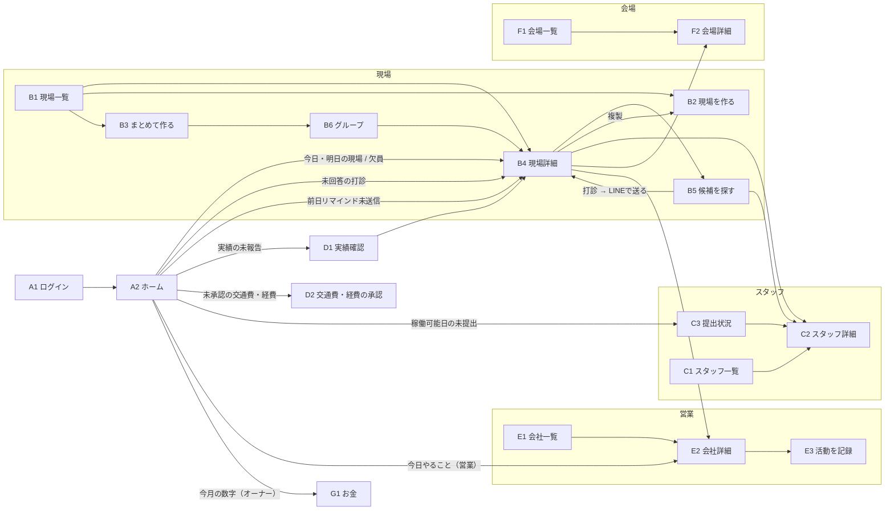
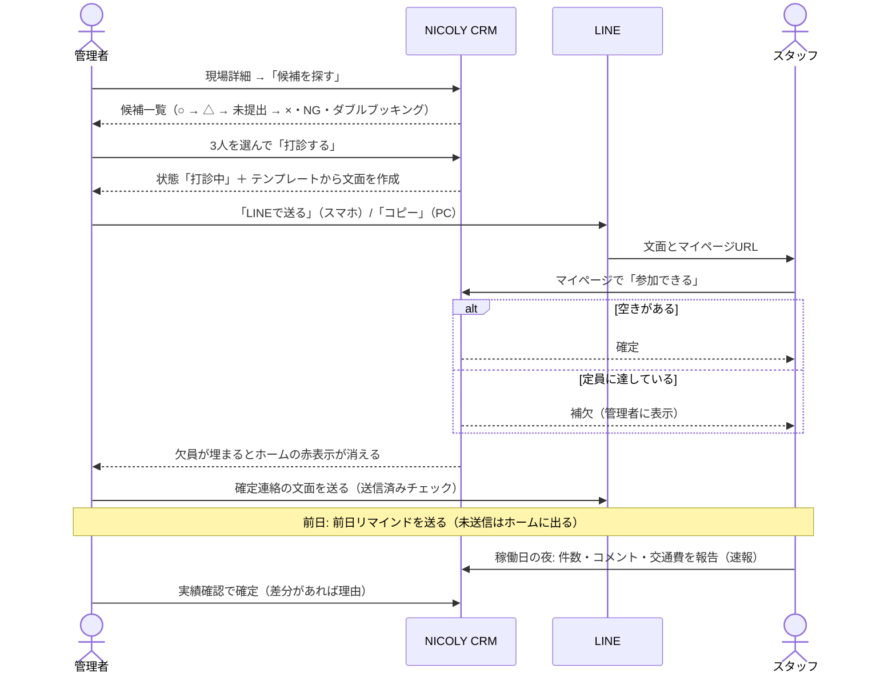
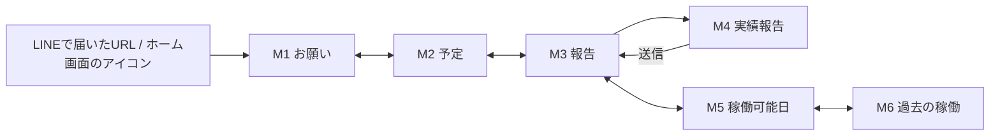

# 画面一覧と画面遷移（Phase 0 案）

## 1. ナビゲーション

| | スマホ | PC |
|---|---|---|
| メニュー | 下部タブ「ホーム / 現場 / スタッフ / 営業 / その他」 | 左サイドバー（同じ項目 ＋「お金」［オーナーのみ］＋「設定」） |
| 作成ボタン | 右下の ＋（押すと「現場を作る」「活動を記録」） | 各一覧の右上に「新規作成」 |
| 一覧 → 詳細 | 詳細画面に移動 | 一覧は表形式。詳細は右側パネルで開き、一覧に戻らずに次々確認できる |
| 検索 | 画面上部の検索窓（スタッフ・会社・担当者・会場・現場をまとめて） | 同じ |

「その他」の中身（スマホ）: 会場 / 実績確認 / 交通費・経費の承認 / 稼働可能日の提出状況 / お金（オーナー）/ 設定（オーナー）/ データ取り込み（オーナー）/ 変更履歴（オーナー）/ ログアウト

## 2. 画面一覧

### 管理画面（ログインが必要）

| # | 画面 | URL | 使う人 | 主な内容 | Phase |
|---|---|---|---|---|---|
| A1 | ログイン | `/login` | 全員 | Google でログイン / メールでログインリンクを受け取る | 1 |
| A2 | ホーム | `/` | 全員 | 今日・明日の現場 / 要対応 / 今日やること（営業）/ 今月の数字（オーナー）/ 実績トップ | 1（営業は2、数字は3） |
| A3 | 検索結果 | `/search?q=` | 全員 | スタッフ・会社・担当者・会場・現場をまとめて表示 | 1 |
| B1 | 現場一覧 | `/events` | 全員 | 日付リスト（今日から2週間）⇔ 月カレンダー、祝日表示、絞り込み（取引先・会場・欠員あり・ステータス） | 1 |
| B2 | 現場を作る | `/events/new` | 全員 | 取引先・会場・日付・時刻・集合・役割別の必要人数（服装・持ち物・注意事項は「詳細」に折りたたみ） | 1 |
| B3 | まとめて作る | `/events/bulk` | 全員 | 期間＋曜日（例: 10/1〜10/31 の土日）→ 作られる日付のプレビュー → 作成 | 1 |
| B4 | 現場詳細 | `/events/[id]` | 全員 | 概要・会場情報（地図リンク）/ 役割別の必要人数と欠員 / アサイン一覧（状態の変更・文面の作成）/ 実績 / 複製 / 中止 / 単価の上書き（オーナー、Phase 3） | 1 |
| B5 | 候補を探す | `/events/[id]/candidates` | 全員 | 候補の並び替え済み一覧、複数選択 →「打診する」→ 文面 →「LINEで送る」/「コピー」 | 1 |
| B6 | グループ | `/event-groups/[id]` | 全員 | 一括作成した現場のまとまりを一覧 | 1 |
| C1 | スタッフ一覧 | `/staff` | 全員 | 検索（氏名・かな・電話）、絞り込み（役割・ランク・エリア・状態） | 1 |
| C2 | スタッフ詳細 | `/staff/[id]` | 全員 | 基本情報 / 稼働可能日カレンダー / 今後の予定 / 過去の稼働と獲得実績 / NG / 稼働履歴メモ / マイページURL（コピー・LINEで送る・再発行）/ お金・契約（オーナーのみ） | 1 |
| C3 | 稼働可能日の提出状況 | `/availability?month=` | 全員 | 提出済み・未提出の一覧、全体向けの提出依頼文面、未提出者への個別リマインド、代理入力 | 1 |
| D1 | 実績確認 | `/results` | 全員 | 現場ごと・スタッフごとに速報 → 確定件数を編集して確定、一括確定、差分理由、修正履歴 | 1 |
| D2 | 交通費・経費の承認 | `/expenses` | 全員 | 未承認の申請一覧 → 承認 / 却下 | 1 |
| E1 | 営業（会社一覧） | `/sales` | 全員 | 取引先 / 協力会社タブ、リスト ⇔ カンバン、次回アクション日の順、期限切れ・未設定の表示 | 1は最小限、2で完成 |
| E2 | 会社詳細 | `/sales/[id]` | 全員 | 基本情報 / 担当者（複数）/ 活動履歴 / 関連する現場 / 関連資料のリンク / 請求設定（オーナー、Phase 3） | 1は最小限、2で完成 |
| E3 | 活動を記録 | （E1・E2・＋ボタンから開く画面下からのパネル） | 全員 | 種類 → 結果 → 一言メモ → 次回アクション日（明日 / 3日後 / 1週間後 / 日付指定） | 2 |
| F1 | 会場一覧 | `/venues` | 全員 | 名前・エリア・最寄り駅 | 1 |
| F2 | 会場詳細 | `/venues/[id]` | 全員 | 住所（地図リンク）・最寄り駅・エリア・入館方法・控室・駐車場・主な取引先・過去の現場と獲得実績 | 1 |
| G1 | お金（月次集計） | `/money` | オーナー | 今月の売上・支払・粗利（確定分 / 見込み分）、12か月の推移、取引先別・会場別、目標との比較 | 3 |
| G2 | 請求 | `/money/invoices` | オーナー | 取引先別の請求額と現場ごとの明細 | 3 |
| G3 | 支払い | `/money/payments` | オーナー | スタッフ別の支払額と明細、調整額、インボイス登録の有無、支払済みの入力 | 3 |
| G4 | 月次締め | `/money/closing` | オーナー | チェックリスト → 締める / ロック解除（理由） | 3 |
| G5 | CSV出力 | `/money/export` | オーナー | 請求集計・支払明細・freee 取込用・全データ一括ダウンロード | 3 |
| H1 | 設定 | `/settings/...` | オーナー | ユーザー招待・無効化 / 役割 / 獲得項目 / ランク / エリア / インセンティブ標準単価 / 税・源泉・端数 / 締切日 / 月次目標 / 文面テンプレート（プレビュー付き）/ 会社情報 | 1（お金関係は3） |
| H2 | データ取り込み | `/import` | オーナー | CSV を選ぶ → 列の対応づけ → プレビュー（エラー・重複候補）→ 実行 → 結果 | 1（過去の稼働・実績は2） |
| H3 | 変更履歴 | `/audit` | オーナー | 誰が・いつ・何を・何から何に | 1 |
| — | その他 | `/more` | 全員（スマホ） | 上記「その他」のメニュー | 1 |

### スタッフ用マイページ（ログイン不要）

下部タブ「お願い / 予定 / 報告 / 稼働可能日 / 過去」。1画面1目的、大きなボタン。

| # | 画面 | URL | 主な内容 |
|---|---|---|---|
| M1 | お願い | `/m/[鍵]` | 打診中の現場（日時・会場・役割）→「参加できる」「できない」 |
| M2 | 予定 | `/m/[鍵]/schedule` | 確定した現場（日時・会場・住所［地図リンク］・集合時刻と場所・持ち物） |
| M3 | 報告 | `/m/[鍵]/report` | 報告できる稼働（稼働日〜7日後）の一覧 → 報告画面へ |
| M4 | 実績報告 | `/m/[鍵]/report/[アサイン]` | 獲得項目ごとに ＋ / −、一言コメント、交通費（金額＋区間）、その他の経費 →「送信」 |
| M5 | 稼働可能日 | `/m/[鍵]/availability` | 月カレンダー（今月の残り・翌月）、日をタップで ○ → △ → × → 未入力、メモ →「提出する」 |
| M6 | 過去の稼働 | `/m/[鍵]/history` | 日付・会場・自分の獲得件数（確定 / 速報） |

## 3. 画面遷移

### 3-1. 管理画面

### 3-2. 打診から確定まで（いちばん大事な流れ）

### 3-3. マイページ

## 4. 毎日の操作のタップ数（目標: 3タップ以内）

| 操作 | 流れ | タップ |
|---|---|---|
| 打診（候補を選んだあと） | 「打診する」→「LINEで送る」→ LINE で送り先を選ぶ | 3（＋送り先の選択） |
| スタッフの回答 | LINE の URL を開く →「参加できる」 | 1〜2 |
| 確定連絡 | アサイン一覧の「確定連絡」→「LINEで送る」 | 2 |
| 実績報告（スタッフ） | 「報告」→ 現場を選ぶ → ＋ / − → 「送信」 | ＋/− の回数＋3 |
| 実績の一括確定 | 実績確認 →「速報どおり確定」 | 2 |
| 活動記録 | 「記録する」→ 種類 → 結果 →（メモ）→ 次回アクション候補 | 4（メモを除く。要件 §4.8 の流れどおり） |

## 5. 色と表示のルール

| 色 | 意味 | 例 |
|---|---|---|
| 赤 | 要対応 | 欠員、期限切れの次回アクション、実績の未報告、24時間以上未回答の打診、締切後の未提出 |
| 黄 | 待ち | 打診中、補欠、稼働可能日の未提出（締切前）、未承認の経費 |
| 緑 | 完了 | 人員確定、実績確定、承認済み、提出済み |
| 灰 | 対象外 | 中止、辞退、キャンセル、無効化 |

- 文字は 16px 以上、ボタンなどのタップ領域は 44px 以上。スマホ幅 375px で横スクロールなし。
- 空の画面には次にやることを表示する（例: 現場が0件 →「＋ から現場を作りましょう」）。
- 元に戻せる操作（状態の変更など）は確認ダイアログなしで実行し、画面下に「元に戻す」を数秒表示する。中止・URL再発行・月次締めなど戻せない操作だけ確認する。
- LINE で送るボタンは、PC（Mac / Windows）では出さず「コピー」を主ボタンにする（PC版 LINE ではこの方式が動かないため）。
